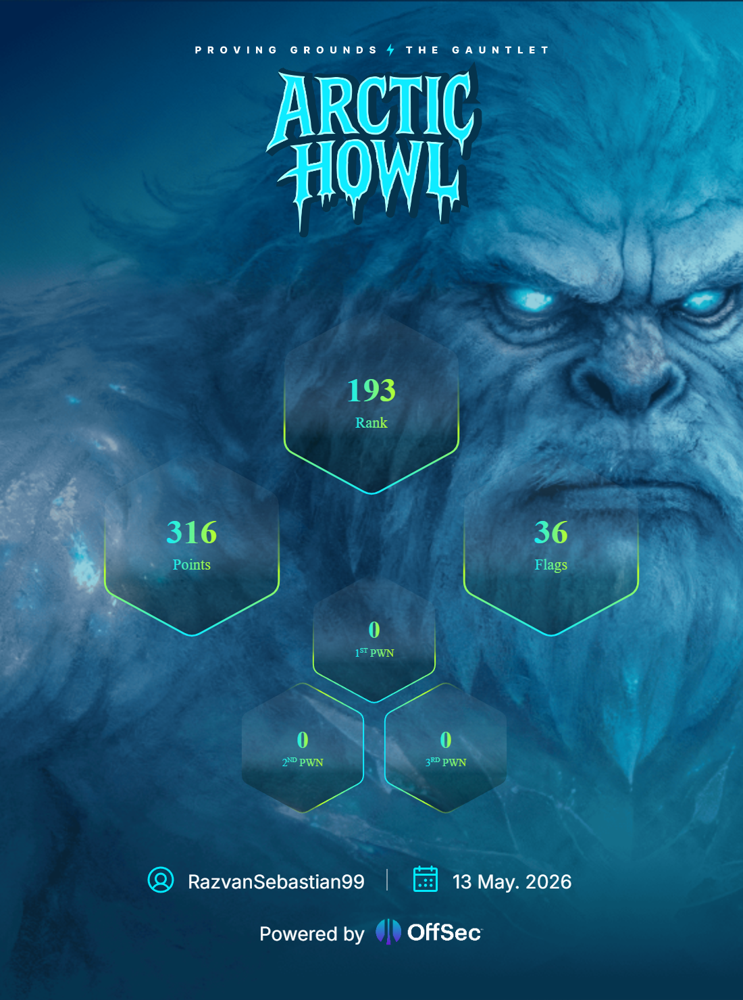

# Arctic Howl

<p align="center">
  
</p>

<p align="center">
  <strong>Proving Grounds ⚡ The Gauntlet</strong><br />
  A frozen cybersecurity battleground where challengers adapt, learn, and outthink evolving threats.
</p>

---

## Overview

**Arctic Howl** is a cybersecurity challenge event set in the Cascade Expanse, where instinct is no longer enough.  
Ashka, an Arctic Wolf and one of the realm’s greatest cybersecurity hunters, has vanished after investigating unusual activity in the Tundra data center.

Through the Gauntlet season, competitors face increasingly difficult labs, uncover the truth behind Ashka’s disappearance, and confront an adversary blurring the line between hunter and machine.

## Event Snapshot

- **Status:** Ended
- **Dates:** March 4 – April 1, 2026
- **Registered players:** 3.5k
- **Theme:** Arctic cyber battleground / threat-hunting gauntlet

## Repository Purpose

This repository contains materials, notes, writeups, tooling, or challenge-related resources for the **Arctic Howl** event.

## Suggested Structure

```text
.
├── README.md
├── arctic-howl-banner.png
├── writeups/
├── notes/
├── scripts/
└── resources/
```

## Notes

Only those who adapt will survive.  
Only those who endure will uncover the truth.  
And only the strongest will reach the heart of the storm.

---

<p align="center">
  <em>Welcome to Arctic Howl.</em>
</p>
